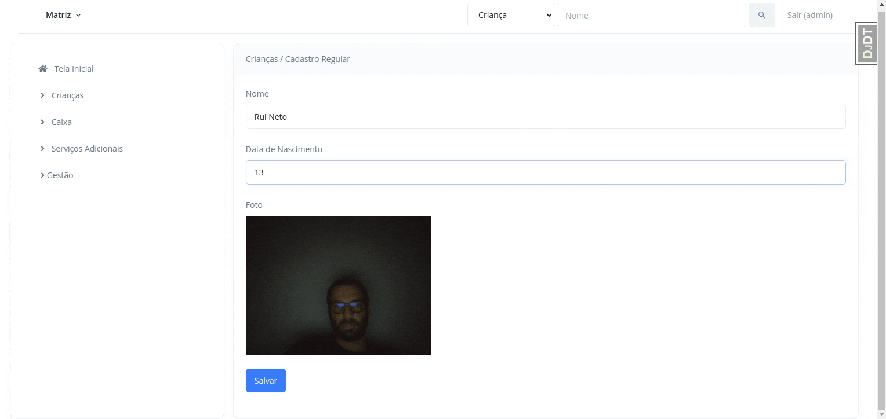

# django-webcampicture

**django-webcampicture** is a very simple Django app that provides a specialization of Django's native `FileField`: `WebcamPictureField`, which allows users to save images taken from their webcams, instead of uploading.

## Quick start

1. Install using `pip`:

```bash
pip install django-webcampicture
```

2. Add *"webcampicture"* to your **INSTALLED_APPS** setting like this:

```python
INSTALLED_APPS = [
    ...
    'webcampicture',
]
```    

3. Use the field in your models:

```python
from django.db import models
from webcampicture.fields import WebcamPictureField

class Child(models.Model):
    name = models.CharField("Name", max_length=255)

    # WebcamPictureField takes the same parameters as FileField
    picture = WebcamPictureField("Picture", upload_to="pictures", blank=True)

    # Image URL example...
    @property
    def picture_url(self):
        if self.picture and hasattr(self.picture, "url"):
            return self.picture.url

```

4. Remember to include in your templates:

```html

<link rel="stylesheet" href="">
<script src=""></script>
```

## Demo



## Settings and default values

```python
WEBCAM_BASE64_PREFIX = "data:image/png;base64,"
WEBCAM_CONTENT_TYPE = "image/png"
WEBCAM_FILENAME_SUFFIX = ".png"
```

## Overridable templates

```text
webcampicture/webcampicture.html
```
